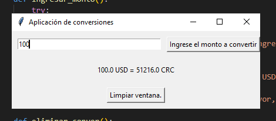
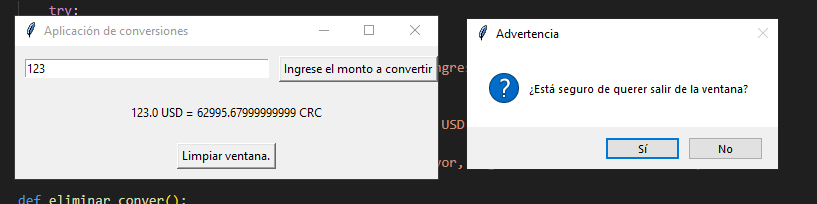
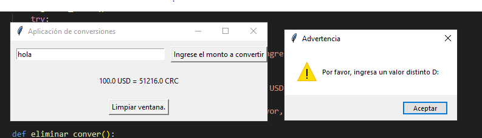
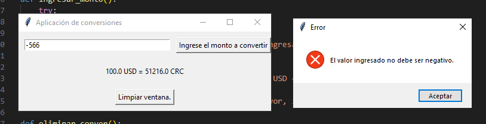
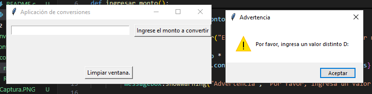

# Conversiones
Naomi Vargas, Quiz 2.

Pasos para el uso del programa.
1-Se abrirá una ventana.
2-Introduzca el monto en dólares (USD) en la caja de texto.
3-Haga clic en el botón "Ingrese el monto a convertir" para ver el resultado de la conversión a colones (CRC).
4-Puede utilizar el botón "Limpiar ventana" para borrar el monto ingresado y el resultado.
5-Para cerrar la ventana, puede presionar el botón de cerrar de la ventana o hacerlo manualmente, confirmando si quiere salir.

Ejemplo de ejecusión:

Salir:

Errores:

